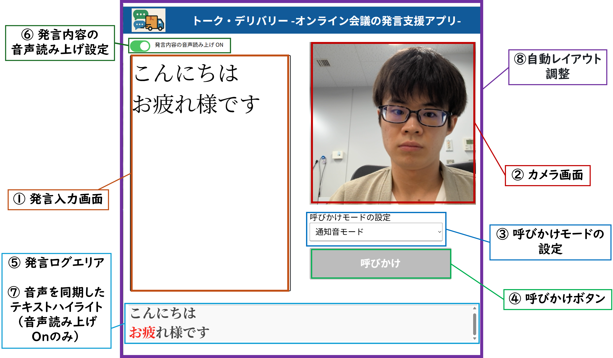

# トーク・デリバリー -オンライン会議向けの発言支援アプリ-

## 1. システム概要

### ① 発言入力画面

発言したい内容を入力し、Enterキーで確定すると、音声で読み上げられます。話したいことがあるときは、この入力欄に入力してください。またEnterキーを2回押すと、発言入力画面内のテキストを自動的に削除できます。

 

### ② カメラ画面

ユーザーの顔を映すためのカメラ画面です。
> ※注意：トーク・デリバリーのウィンドウをZoomのウィンドウ**下に**配置すると、カメラ画面が非表示になる場合があります。
 

### ③ 呼びかけモードの設定

「通知音モード」と「今いいですか？モード」の2種類から選択できます。呼びかけモードにより、ボタンを押した際の呼び出し方法が異なります。

* **通知音モード**：トントンとノックする音が送信されます。
* **今いいですか？モード**：「今いいですか？」というテキストが送信されます。

 

### ④ 呼びかけボタン

このボタンを押すことで、通知音や音声で相手に呼びかけることができます。発言の意思を示したいときに使用してください。

 

### ⑤ 発言ログエリア

入力した内容がログとして保存されます。過去の発言を確認したい場合にご利用ください。

 

### ⑥ 発言内容の音声読み上げ設定

発言内容を音声で読み上げるかどうかを、On／Offで切り替えることができます。（初期設定：Off）

 

### ⑦ 音声と同期したテキストハイライト

（音声読み上げがオンの場合）読み上げの進行にあわせて、「発言ログエリア」に入力したテキストが赤色で順にハイライト表示されます。

 

### ⑧ 自動レイアウト調整

ブラウザ画面のサイズに応じて、各機能の表示サイズが自動で調整されます。画面サイズを小さくしても、Zoomなど他のアプリと重ねて使用することが可能です。

 

## 2. 利用方法

### Step1. トーク・デリバリーのセットアップ

1. GitHubページ右上の **「Code」 → 「Download ZIP」** をクリックし、トーク・デリバリーのファイルをダウンロードします。
2. ダウンロードしたZIPファイルを解凍（展開）します。
3. 展開したフォルダ内の `index.html` をダブルクリックして、トーク・デリバリーをブラウザで開きます。

 

### Step2. OBS Studioのインストール（未導入の方）

1. [OBS公式サイト](https://obsproject.com/ja) にアクセスし、お使いのOSに合ったインストーラー（Windows / macOS）をダウンロードします。
2. ダウンロードしたインストーラーを実行し、画面の指示に従ってインストールします。
3. インストール後、OBSを起動します。

 

### Step3. OBSで仮想カメラを設定する方法（Zoomと連携）

1. OBSを起動します。
2. **ソースの追加**（画面下の「+」ボタン）から、「**ウィンドウキャプチャ**」を選択します。
3. 任意の名前（例：TalkExpress）を入力して「OK」をクリックします。
4. 「**ウィンドウキャプチャ**」をダブルクリックし、「ウィンドウ」にトーク・デリバリーの画面を選択する。
5. 設定が完了したら「OK」をクリックします。
6. 画面の大きさを調整します。
7. OBS上部メニューの「**ツール** → **仮想カメラを開始**」を選択します。

 

### Step4. ZoomでOBSの映像を使う方法

1. Zoomを起動し、「設定」→「ビデオ」に移動します。
2. 「カメラ」一覧から「**OBS Virtual Camera**」を選択します。
3. Zoomの画面にトーク・デリバリーの画面が表示されれば成功です。

> 💡 **補足：**
>
> - トーク・デリバリーのウィンドウは、Zoomと重ねて使用できます。カメラ画面が表示されない場合は、ウィンドウの重なり順（前面・背面）を調整してください。
>
> - 音声入力には、Zoom側で正しいマイクが選択されているか確認してください。  
>   特におすすめなのは、仮想オーディオデバイス [**VB-CABLE**](https://vb-audio.com/Cable/) の使用です。これにより、パソコン内の音声のみをZoomに送信できるため、周囲の雑音を気にせずに発言が可能になります。
>   
>   **VB-CABLEの設定方法：**
>   - デバイスのサウンド設定で、**出力デバイス（スピーカー）**を `CABLE Input（VB-Audio Virtual Cable）`  に変更します。
>   - Zoomの「設定」→「オーディオ」で、以下のように設定してください：
>     - **マイク**：`CABLE Input（VB-Audio Virtual Cable）`  
>     - **スピーカー**：`CABLE Input（VB-Audio Virtual Cable）`
>
> - Zoomの設定で、以下のように **ノイズ除去レベル** を変更してください：  
>   「設定」→「オーディオ」→「オーディオ プロフィール」→「Zoom バックグラウンド ノイズ除去」→ **「低（かすかな背景雑音）」**  
>   これにより、通知音が聞こえなくなるのを防ぐことができます。

 

## 3. 推奨環境

* **OS**：Windows（Macでも動作可能）
* **ブラウザ**：Google Chrome、Microsoft Edge（※FireFoxは「自動レイアウト調整」が正しく動作しない可能性があります）

 

## 4. アップデート情報

2025/07/04（金）16:50  トーク・デリバリーのシステム紹介画像や、「トーク・デリバリー」の一部の機能「⑦ 音声と同期したテキストハイライト」に関する情報を更新しました。
 
※トーク・デリバリーの紹介動画と、利用方法の説明動画を後日アップロードする予定です。しばらくお待ちいただけますと幸いです。
